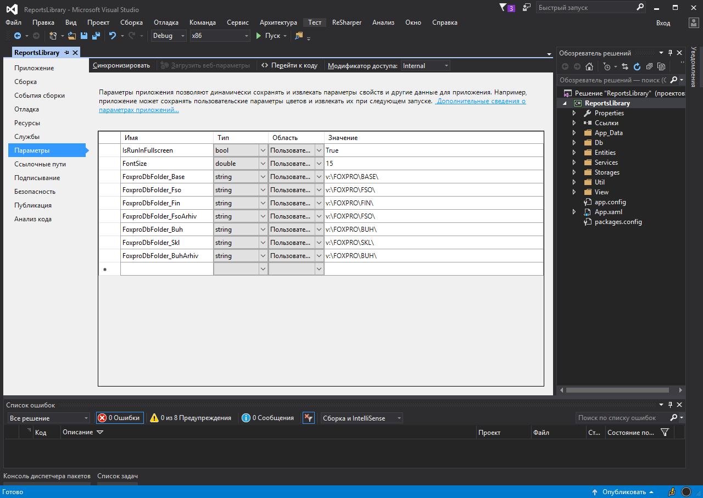
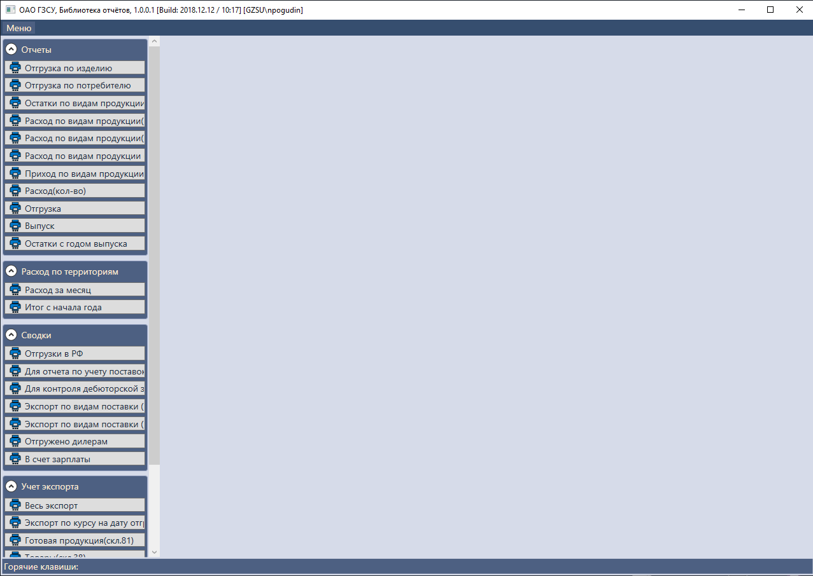
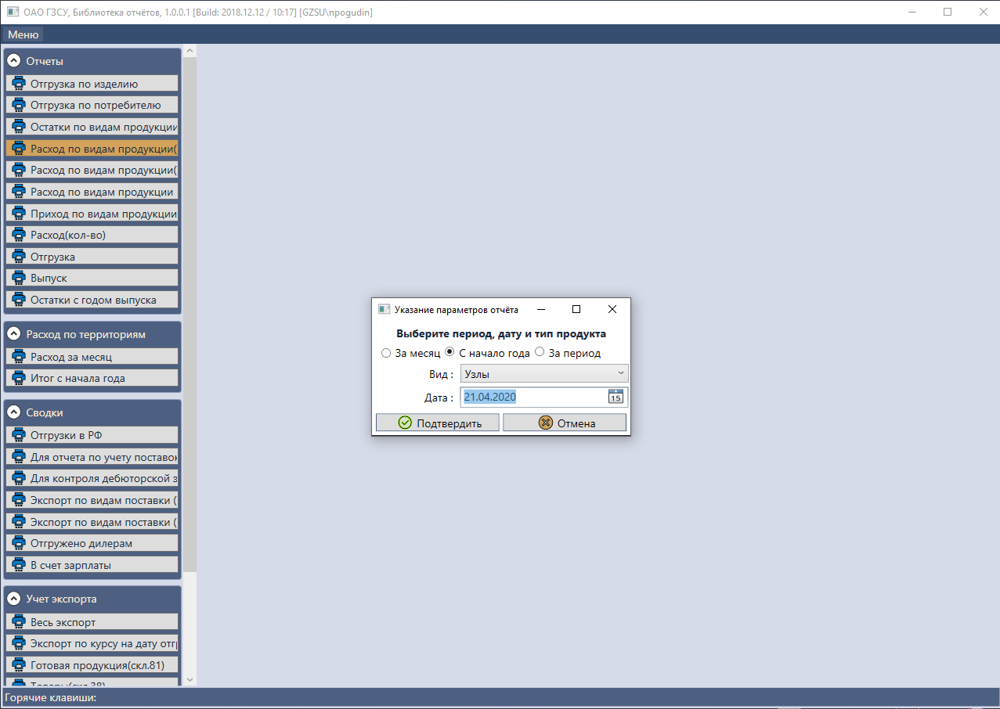
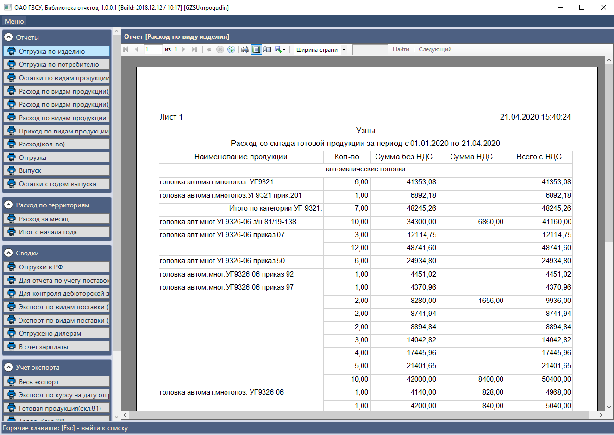

# ReportsLibrary

Рабочее название: *ReportsLibrary*  
Приложение **АРМ Отчеты** - десктоп-приложение для получение различных отчетов по готовой продукции завода(приход, расход, разгрузка, выпуск и тд.).

### Использует имеющиеся DBF базы предприятия: 
- Таблица банков [pot_bank.dbf] 
- Таблицы организаций с указанным УНП/Городом [potr.dbf]
- Таблица изделий/продукции/услуг [izdel.dbf]
- Таблица категорий продукции [kat_prod.dbf]
- Таблица цен изделий [cenaizd.dbf]
- Таблица складов предприятия [sklad.dbf]
- Таблица цехов предприятия [fspodraz.dbf]
- Таблица приходов/расходов [prrasos.dbf]
- Таблица выпусков [pnakl.dbf]
- Таблица курсов валют [kurs_val.dbf]

### Параметры инициализации в IDE  
Параметры инициализации проекта на каждой машине разработчика (все файлы настроек описаны в .gitignore, дабы не перезатирать при каждом коммите): 

Параметр | Тип | Значение | Комментарий 
-------- | --- | -------- | -----------
IsRunInFullscreen               | bool   | True                 | Признак запуска приложения в полноэкранном режиме 
FontSize               			| double | 15                   | Размер шрифта
FoxproDbFolder_Base          	| string | v:\FOXPRO\BASE\      | Путь до dbf таблиц базовых
FoxproDbFolder_Fso              | string | v:\FOXPRO\FSO\ 	    | Путь до dbf таблиц fso отдела
FoxproDbFolder_Fin              | string | v:\FOXPRO\FIN\       | Путь до dbf таблиц финансового отдела
FoxproDbFolder_FsoArhiv         | string | v:\FOXPRO\FSO\Arhiv\ | Путь до архива dbf таблиц fso отдела
FoxproDbFolder_Buh              | string | v:\FOXPRO\BUH\       | Путь до dbf таблиц бухгалтерии
FoxproDbFolder_Skl              | string | v:\FOXPRO\SKL\       | Путь до dbf таблиц складов
FoxproDbFolder_BuhArhiv     	| string | v:\FOXPRO\BUH\Arhiv\ | Путь до архива dbf таблиц бухгалтерии

### Скриншоты окна настроек и рабочего приложения  

  

  

  

  
